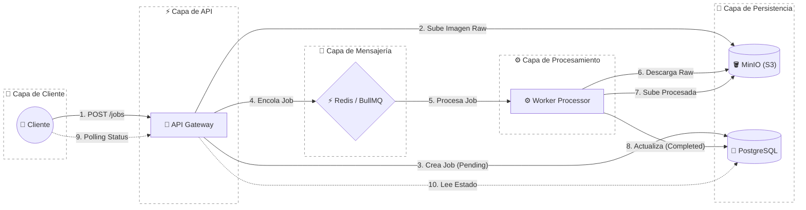

# PixelForge - Sistema Distribuido de Procesamiento de Imágenes


**PixelForge** es una plataforma de procesamiento de imágenes de alto rendimiento diseñada bajo una arquitectura de microservicios orientada a eventos. Su objetivo principal es desacoplar la ingesta de datos del procesamiento intensivo, garantizando escalabilidad, resiliencia y una experiencia de usuario fluida incluso bajo cargas elevadas.

El sistema implementa un patrón **Producer-Consumer** robusto, utilizando **BullMQ** y **Redis** para la gestión de colas, y **MinIO** como almacenamiento de objetos compatible con S3.

## 📋 Tabla de Contenidos

- [Arquitectura del Sistema](#-arquitectura-del-sistema)
- [Principios de Diseño](#-principios-de-diseño)
- [Stack Tecnológico](#-stack-tecnológico)
- [Características Principales](#-características-principales)
- [Estructura del Proyecto](#-estructura-del-proyecto)
- [Instalación y Uso](#-instalación-y-uso)
- [Documentación de la API](#-documentación-de-la-api)

## 🏗 Arquitectura del Sistema

La arquitectura separa las responsabilidades en dos servicios principales dockerizados, comunicados asíncronamente.



1.  **API Service (Producer)**:
    - Punto de entrada RESTful construido con **Express**.
    - Valida peticiones y tipos de archivo utilizando **Zod**.
    - Sube la imagen "cruda" a **MinIO**.
    - Delega el procesamiento enviando un mensaje a la cola de **Redis**.

2.  **Worker Service (Consumer)**:
    - Servicio independiente que "escucha" nuevos trabajos.
    - Ejecuta transformaciones de imagen intensivas en CPU (redimensionamiento, conversión de formato) usando **Sharp**.
    - Gestiona el ciclo de vida del Job y actualiza el estado final en **PostgreSQL**.
    - Diseñado para escalar horizontalmente según la demanda.

## 🧩 Principios de Diseño

- **Separación de Responsabilidades (SoC):** La API solo gestiona peticiones HTTP; el Worker se encarga de la lógica de negocio pesada.
- **Código Compartido (Shared Kernel):** Uso de un módulo `shared` para tipos, esquemas de validación (Zod) y constantes, asegurando consistencia entre microservicios.
- **Fail Fast:** Validaciones estrictas al inicio del flujo para rechazar peticiones inválidas inmediatamente, ahorrando recursos de procesamiento.
- **Infraestructura Inmutable:** Todo el entorno (DB, Cache, Storage) está contenerizado con Docker, garantizando paridad entre desarrollo y producción.

---

## 🚀 Stack Tecnológico

- **Lenguaje:** TypeScript (Strict Mode)
- **Runtime:** Node.js
- **API Framework:** Express.js
- **ORM:** Prisma (PostgreSQL)
- **Colas:** BullMQ + Redis
- **Procesamiento de Imágenes:** Sharp
- **Validación:** Zod
- **Storage:** MinIO (AWS S3 Compatible)
- **Infraestructura:** Docker, Docker Compose

---

## ✨ Características Principales

- **Procesamiento Asíncrono Non-blocking:** La API responde en milisegundos (`202 Accepted`) devolviendo un Job ID, liberando al cliente mientras el servidor procesa en background.
- **Validación Estricta (Allowlist):** Seguridad por diseño, permitiendo solo formatos y dimensiones preestablecidas.

  **Formatos permitidos:**
  - `WEBP` (Default)
  - `JPEG`
  - `PNG`
  - `AVIF`

  **Dimensiones permitidas (WxH):**
  - `256x256`
  - `512x512`
  - `1024x1024`
  - `1920x1080`

- **Trazabilidad:** Persistencia de metadatos de trabajos en PostgreSQL para auditoría y seguimiento de estados (`queued`, `processing`, `completed`, `failed`).
- **Almacenamiento Escalable:** Uso de MinIO para simular un entorno de producción S3 real.

---

## 📂 Estructura del Proyecto

La estructura sigue una organización modular monorepo, centralizando la lógica compartida.

```plaintext
pixelforge/
├── src/
│   ├── api/                 # API REST (Producer)
│   │   ├── controllers/     # Controladores de endpoints
│   │   ├── middleware/     # Middlewares (Multer, ErrorHandler, etc.)
│   │   ├── routes/          # Definición de rutas v1
│   │   ├── services/        # Servicios de negocio (JobService, StorageService)
│   │   └── server.ts        # Entrypoint del servidor
│   ├── worker/              # Worker (Consumer)
│   │   ├── processors/      # Lógica de procesadores de Jobs
│   │   └── main.ts          # Entrypoint del Worker
│   │   └── worker.setup.ts  # Configuración del Worker
│   ├── shared/              # Núcleo Compartido
│   │   ├── repositories/    # Capa de acceso a datos y persistencia
│   │   ├── schemas/         # Esquemas Zod (JobSchema, EnvSchema)
│   │   ├── services/        # Servicios de negocio
│   │   ├── types/           # Definiciones de tipos TypeScript
│   │   └── prismaClient.ts  # Instancia singleton de Prisma
│   └── config/              # Archivos de configuración general
├── docs/                    # Documentación y colecciones Postman
├── docker-compose.yml       # Orquestación de servicios
├── Dockerfile.api           # Imagen optimizada para API
├── Dockerfile.worker        # Imagen optimizada para Worker
└── README.md
```

---

## 🛠 Instalación y Uso

### Prerrequisitos

- Docker y Docker Compose.

### Despliegue Local

1.  **Clonar el repositorio**:

    ```bash
    git clone https://github.com/daniieldz/pixelforge.git
    cd pixelforge
    ```

2.  **Configurar Variables de Entorno**:
    Copia el archivo de ejemplo para configurar tus variables locales.

    ```bash
    cp .env.example .env
    ```

    _El archivo `.env.example` ya contiene valores por defecto funcionales para el entorno de Docker local._

3.  **Iniciar servicios**:

    ```bash
    docker-compose up --build -d
    ```

    _Esto levantará API, Worker, Redis, Postgres y MinIO._

4.  **Verificar estado**:
    ```bash
    docker-compose ps
    ```

**Accesos:**

- **API:** http://localhost:3000
- **MinIO Console:** http://localhost:9001 (User/Pass definidos en `.env`)

---

## 📡 Documentación de la API

Se incluye una colección de Postman en `docs/pixelforge.postman_collection.json` para facilitar las pruebas.

### 1. Crear Trabajo (Subir Imagen)

- **Endpoint:** `POST /api/v1/jobs`
- **Content-Type:** `multipart/form-data`

| Key | Tipo | Descripción |
| :--- | :--- | :--- |
| `file` | File | Imagen a procesar (jpg, png). |
| `width` | Int | Ancho objetivo (ej: 1024). |
| `height` | Int | Alto objetivo (ej: 1024). |
| `format` | String | Formato de salida (webp, png, jpeg, avif). |

### 2. Consultar Estado

- **Endpoint:** `GET /api/v1/jobs/:id`

**Respuesta de Ejemplo (Completado):**

```json
{
  "jobId": "550e8400-e29b-41d4-a716-446655440000",
  "status": "completed",
  "result": {
    "url": "http://minio:9000/pixelforge-bucket/processed/imagen_1024x1024.webp",
    "processedAt": "2023-12-30T10:00:00Z"
  }
}
```

---

## 👤 Autor

Desarrollado por [Daniel Díaz](https://www.linkedin.com/in/daniiel-diazz).
